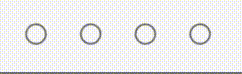
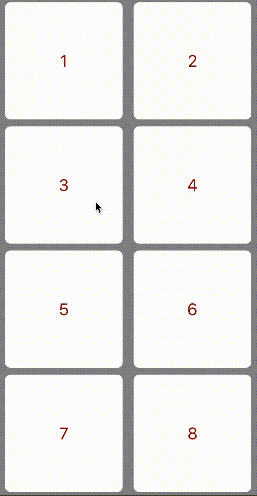

# CUIKit

[](https://img.shields.io/badge/platform-iOS-green.svg)
[](https://swift.org)


## Библиотека UI компонентов

- Компоненты для iOS помогают разработчикам выполнять дизайн
- Поддерживают Swift и Interface Builder

## Требования

- iOS 13+
- macOS 10.15
- Swift 5.0

## Компоненты

- [CollectionViewLayout](#collectionviewlayout)
- [Pin](#pin)
- [Progress](#progress)
- [FeedbackGenerator](#feedbackgenerator)
- [Designable](#designable)
- [ViewFactory](#viewfactory)
- [NibLoad](#nibload)
- [ActivityIndicators](#activityindicators)
- [Actions](#actions)
- [Phone](#phone)
- [CostumeUI](#costumeui)
- [ExpandableButtons](#expandablebuttons)
- [Animations](#animations)

### CollectionViewLayout

Слои для работы с коллекциями.

| Компонент       | Описание                |
| ------------- |------------------|
| RearrangeableCollectionViewLayout     | Слой с возможностью перемещения элементов    |
| ProgressLayout     | Слой с отображением прогресса загрузки ячеек |
| ColumnFlowLayout  | Слой умеющий вычислять количество ячеек на основе размера экрана |
| MaxColumnFlowLayouts  | Слой коллекции который стремится разместить максимальное количество ячеейк в строке, но ширину ячейки сделать больше минимальной |
| MinColumnFlowLayouts  | Слой коллекции который стремится создать максимальную по размеру ячейки, но количество колонок обязательно больше минимально заданного |

### Pin



View для отображения ввода пин-кода. Позволяет настроить:

- количество точек для отображения пароля
- размер точек
- расстоянние между точками
- цвета заливки и границы точек
- цвет для отображения ввода неправильного пароля

### Progress

View с круглым индикатором в центре. Настраивается время анимации, цвет прогресса, толщина линии.

<p float="center">
  
</p>

Кнопка с круглым индикатором прогресса. Настраивается цвет заполненной/незаполненной линии, толщина линий, прогресс заполнения.

<p float="center">
  
</p>

### FeedbackGenerator

Класс для генерации откликов на действия пользователя.

### Designable

Протоколы:

- Borderable - элемент пользовательского интерфейса со свойствами явных границ
- Shadowable - элемент пользовательского интерфейса со свойствами тени
- Roundable - элемент пользовательского интерфейса со свойствами округления

Компоненты удовлетворяющие протоколам выше:

- DesignableImageView
- DesignableButton
- ShadowableImageView
- DesignableView
- DownloadProgressView
- MaterialTextView

### ViewFactory

Протоколы реализуеющие создание View и Cell через фабрику.

### NibLoad

Загрузка view через nib.

### ActivityIndicators

Индикаторы прогресса отображают продолжительность процесса или выражают неопределенное время ожидания.

### Phone

TextFiled с подчеркиванием и маской для номера телефона.

### CostumeUI

UITableView и  UICollectionView с поддержкой логики состояния.

### Animations

| Компонент | Описание |
| ------------- |------------------|
| ShowHiddenAbility | Протокол возможности скрытия и показа |
| RippleView | View с возможностью импульсной анимации |
| ShakeAnimation | Протокол анимации встряхивания |
| TransformZoom | Протокол анимациии изменения размера |
| CompletionAnimation | Протокол завершения анимациии |

___

## Установка

Чтобы установить CUIKit, просто добавьте следующую строку в свой Podfile:

```ruby
pod 'CUIKit'
```

## Обновить документацию

1. устанавливать [Jazzy](https://github.com/realm/jazzy) если не установлен
2. выполнить команду

```bash
cd path/to/cuikit
jazzy --theme jony -o Docs
```
